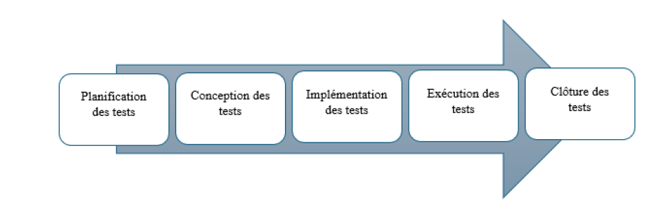

# 📱 Travel Tracer – Formation Test Logiciel

📝 **Description**  
Ce projet s'inscrit dans le cadre de ma formation en test logiciel et vise à appliquer un processus de test structuré sur une application mobile, **Travel Tracer**. Cette application a pour objectif de faciliter l'exploration et la découverte du Maroc pour les touristes et visiteurs.

📌 **Étapes**  

1️⃣ **Définition du projet et spécifications**  
- Élaboration du cahier des charges fonctionnel, incluant :  
  - **Spécifications fonctionnelles** : Définition des principales fonctionnalités de l'application.  
  - **Spécifications non fonctionnelles** : Charte graphique, exigences de performance et de sécurité...

2️⃣ **Gestion et planification des tests**  
- Création du Product Backlog contenant :  
  - **User Stories détaillées**.  
  - **Priorisation des fonctionnalités** en utilisant des outils de collaboration tels que Trello, Jira et Azure DevOps.

3️⃣ **Mise en place du processus de test**  
- Application des bonnes pratiques et méthodologies de test logiciel.  
- Schéma du processus de test :  
  

4️⃣ **Gestion des tests**  
- Utilisation d'outils de gestion des tests tels que TestRail, TestLink et XRay pour assurer une organisation efficace des cas de test et leur suivi.

5️⃣ **Exécution des tests**  
**Tests Fonctionnels**  
- Test manuel et automatisation des tests sur des applications existantes.  
- **Outils utilisés** :  
  - Selenium IDE avec JUnit  
  - Selenium WebDriver  
  - Robot Framework  

**Tests Non Fonctionnels**  
- Tests de performance avec JMeter.  
- Tests API et sécurité avec Postman.
